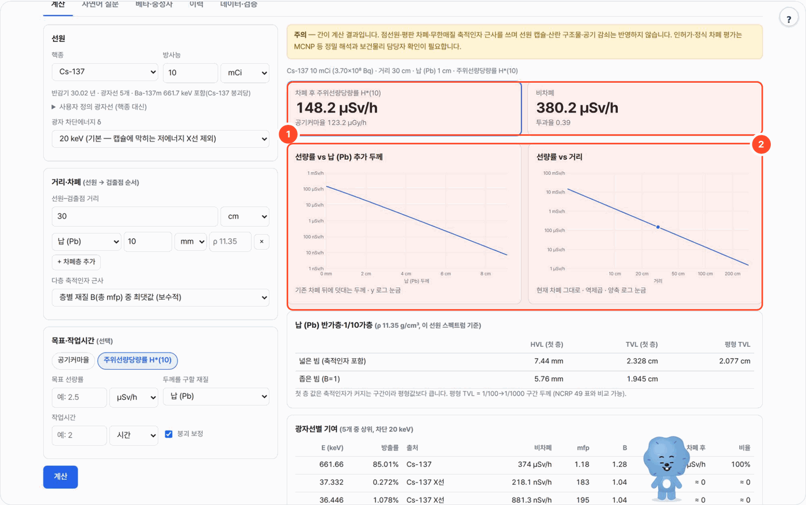
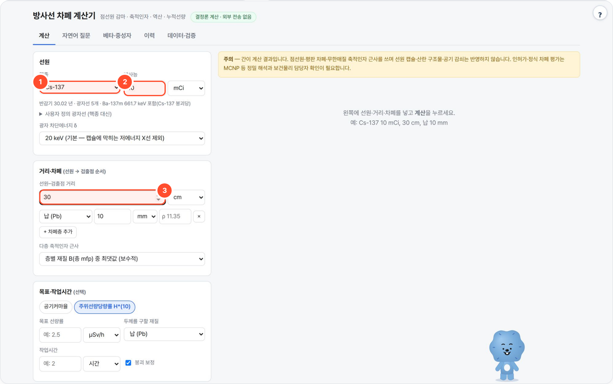

# shield-local — 방사선 차폐·선량 간이 계산기

"이 선원을 이 거리에서 이 차폐로 막으면 선량률이 얼마인가"를 실험 계획·안전 검토 때 빠르게 보는 로컬 웹 도구입니다. 포트 `8784`.

> **간이 계산입니다.** 점선원·평판 차폐·무한매질 축적인자 근사를 쓰며 선원 캡슐·산란 구조물·공기 감쇠는 반영하지 않습니다.
> 인허가·정식 차폐 평가는 MCNP 등 정밀 해석과 보건물리 담당자 확인이 필요합니다. (화면·보고서에 항상 표시)



## 무엇을 하나

- 점선원 감마: NIST XCOM μ/ρ 와 ANSI/ANS-6.4.3 G-P 축적인자로 **공기커마율과 주위선량당량률 H*(10)** 를 계산합니다. 다층 차폐, 목표 선량률 → 필요 두께·거리 역산, 반가층·1/10가층, 작업시간 → 누적선량(붕괴 보정)도 같은 엔진입니다.
- 계산은 모두 결정론적(공개 표준 데이터 + 교과서 식)이고 표준 라이브러리만 씁니다. 데이터는 `data/` 에 동봉되어 외부 전송 없이 폐쇄망에서 동작합니다.
- 로컬 LLM(포털 기본: Ollama `gemma4:31b`)은 **자연어 질문** 탭에서 질문을 입력 JSON 으로 바꾸고 결과를 설명하는 데만 씁니다.
- 베타·중성자 탭은 경고와 비차폐 H*(10) 수준입니다. 중성자 차폐 두께 역산은 지원하지 않습니다.

## 사용 방법



1. **계산** 탭에서 핵종(①, 29종)과 방사능(②, Bq·GBq·Ci·mCi·μCi…)을 고르고 선원–검출점 거리(③)를 넣습니다.
2. 차폐층을 선원 쪽부터 재질·두께 순으로 쌓고(**+ 차폐층 추가**) **계산**을 누릅니다. 숫자는 전부 로컬 Python 이 계산합니다.
3. 결과의 핵심 지표(결과 화면 ①: 차폐 후 H*(10)·공기커마율, 비차폐 대비 투과율)와 그래프(②)를 보고, 아래의 반가층·1/10가층, 광자선별 기여, 단계별 계산 근거를 확인합니다.
4. (선택) **목표·작업시간**에 목표 선량률과 재질을 넣으면 필요한 추가 두께를, 작업시간을 넣으면 누적선량을 더합니다. 보고서는 MD·PDF(인쇄)로 받고, 모든 계산은 **이력** 탭에 남습니다.

## 예시

포털 경유로 실제 실행한 결과입니다(2026-10-07).

- **입력**: Cs-137 · 방사능 10 mCi (3.70×10⁸ Bq) · 거리 30 cm · 납(Pb) 10 mm · 광자 차단에너지 20 keV · 다층 축적인자 '층별 최댓값'
- **출력**: 차폐 후 H*(10) **148.2 μSv/h** · 공기커마율 123.2 μGy/h · 비차폐 380.2 μSv/h · 투과율 0.39
- 같은 화면의 납 반가층·1/10가층: 넓은 빔 HVL 7.44 mm · 첫 TVL 2.328 cm · 평형 TVL 2.077 cm, 좁은 빔 HVL 5.76 mm · TVL 1.945 cm

## 설치·실행

```bash
bash setup.sh            # Python 3.9+ 확인 → LLM 탐색(선택) → selftest → http://localhost:8784
bash setup.sh stop
python3 selftest.py      # LLM 없이 전체 검증 (임시 WORKSPACE)
python3 validation.py    # 문헌 기준값 대조표 출력
python3 app.py --cli '{"source":{"nuclide":"Cs-137","activity":{"value":10,"unit":"mCi"}},"distance":{"value":30,"unit":"cm"}}'
```
표준 라이브러리만 씁니다(pip 설치 없음). 데이터는 `data/` 에 동봉되어 폐쇄망에서 그대로 동작합니다.
환경변수: `PORT`(8784) · `WORKSPACE`(계산 이력, 포털이 지정) · `LLM_API`/`LLM_BASE_URL`/`LLM_MODEL`(자연어 질문용, 없어도 계산은 동작 — 코드 기본 `ollama` / `http://localhost:11434` / `qwen3:8b`, 포털로 띄우면 로컬 Ollama(`:11436`)의 `gemma4:31b`).

## 기능

| 탭 | 내용 |
|---|---|
| 계산 | 핵종(29종)·사용자 정의 광자선, 방사능(Bq·kBq·MBq·GBq·TBq·Ci·mCi·μCi), 거리, 다층 차폐(납·텅스텐·철·SS304·구리·알루미늄·콘크리트·물·PE, 밀도 변경 가능) → 공기커마율·H*(10) / 목표 선량률 → 필요 두께·필요 거리 / 반가층·1/10가층(넓은 빔 첫 층·평형, 좁은 빔) / 작업시간 → 누적선량(붕괴 보정)·선량한도 대비 / 선량률–두께·선량률–거리 그래프 / 광자선별 기여 / 단계별 계산 근거(식과 대입값) / MD 보고서·PDF(인쇄) |
| 자연어 질문 | "Cs-137 10 mCi 30 cm 거리 2.5 μSv/h 이하로 납 몇 mm?" → LLM 이 입력 JSON 으로 변환 → 코드가 단위·핵종·재질을 검사하고 **질문에 없는 숫자가 들어오면 계산을 멈춤** → 결정론 계산 → LLM 설명(결과에 없는 숫자가 나오면 경고) |
| 베타·중성자 | 베타: E<sub>max</sub>(DDEP Q 값), Katz–Penfold 최대비정(아크릴·Al·물·유리·납 두께), 제동복사 전환비 ≈ 3.5×10⁻⁴·Z·E<sub>max</sub> 경고. 중성자(Cf-252, Am-Be): **비차폐 H*(10) 만**, 차폐 두께는 **미지원** |
| 이력 | 모든 계산을 `WORKSPACE/history/*.json` 에 저장, 다시 열기·MD 다운로드·삭제 |
| 데이터·검증 | 출처, 핵종별 광자선·Γ 상수, 문헌 기준값 대조표(서버에서 매번 재계산) |

## 계산 방법

점등방선원, 선원–검출점 사이 평판 차폐(수직 입사), 광자선 i 마다:

```
φᵢ   = A·yᵢ / (4π r²)                                         비충돌 플루언스율 [cm⁻² s⁻¹]
K̇₀ᵢ  = φᵢ · Eᵢ · (μen/ρ)공기(Eᵢ) · 1.602177×10⁻¹³ J/MeV · 10³ g/kg · 3600 s/h     [Gy/h]
Xᵢ   = Σ_층 (μ/ρ)(Eᵢ) · ρ · t                                   광학 두께 [mfp]
K̇    = Σᵢ K̇₀ᵢ · B(Eᵢ, Xᵢ) · e^(−Xᵢ)                             공기커마율
Ḣ*(10) = Σᵢ K̇₀ᵢ · B · e^(−X) · (H*(10)/Ka)(Eᵢ)                  주위선량당량률
```

- **선량 양**: 공기커마율(Gy/h)과 주위선량당량률 H*(10)(Sv/h)을 둘 다 계산하고, 화면에서 어느 것을 주로 볼지·목표로 할지 고릅니다.
  선량한도 비교는 H*(10) 으로 합니다(유효선량의 보수적 운영량).
- **μ/ρ**: NIST XCOM, **간섭성(Rayleigh) 산란 제외** 값(ANS-6.4.3 축적인자와 같은 규약, 보수적). 예: 납 661.7 keV 0.1035 (간섭성 포함 0.1102) cm²/g.
- **축적인자 B**: ANSI/ANS-6.4.3 G-P 노출 축적인자.
  `K(x)=c·x^a + d·(tanh(x/Xk−2)−tanh(−2))/(1−tanh(−2))`, `B=1+(b−1)(K^x−1)/(K−1)` (K=1 이면 `1+(b−1)x`).
  표 에너지 사이는 각 표 에너지에서 B 를 구해 ln B–ln E 선형 보간. 40 mfp 초과는 40 mfp 값 사용(경고).
- **다층**: 총 mfp X 에 대해 ① **층 재질별 B(X) 중 최댓값**(기본, 보수적) ② 마지막 층 재질의 B(X) ③ B=1(좁은 빔) 중 선택.
- **보간**: μ/ρ·μen/ρ·H*/Ka 는 log-log. 흡수끝(납 K 88.0 keV, L 13~16 keV, 텅스텐 K 69.5 keV)은 끝 위아래 값을 따로 두고 넘어 보간하지 않음(끝 에너지 정확히는 아래 값).
- **역산 두께**: 기존 차폐 뒤에 선택 재질을 덧대어 선량률 = 목표가 되는 두께를 이분법으로 구함(되대입 오차 < 0.01 %). 필요 거리 = r·√(Ḋ/목표).
- **HVL/TVL**: 이 선원 스펙트럼 그대로 넓은 빔(축적인자 포함)·좁은 빔에서 1/2·1/10 이 되는 첫 두께, 평형 TVL = 1/100→1/1000 구간 두께.
- **누적선량**: `Ḋ₀·(1−e^(−λT))/λ` (붕괴 보정, 끌 수 있음).
- **선량한도**(원자력안전법 시행령 별표 1): 방사선작업종사자 연 50 mSv·5년 100 mSv, 수시출입자·운반종사자 연 12 mSv, 일반인 연 1 mSv — 개정 여부는 보건물리 담당자 확인.
- **광자 차단에너지 δ**: 기본 20 keV(캡슐에 막히는 저에너지 X선 제외, 문헌 Γ_δ 관례), 선택 10 keV.

## 데이터 출처 (버전)

| 데이터 | 출처 | 파일 |
|---|---|---|
| 질량감쇠계수 μ/ρ (간섭성 포함/제외) | NIST XCOM v3.1 (Berger, Hubbell, Seltzer et al., NIST SRD 8), 원소별 조회 — 10 keV~20 MeV, NIST 표준 격자(흡수끝 포함) + 10년당 40점 조밀 격자. 혼합물(콘크리트·물·PE·공기)은 NIST 조성(NISTIR 5632 Table 2) 질량분율 가중합, SS304 는 공칭 조성 | `data/xcom.json` |
| 공기 μen/ρ | Hubbell & Seltzer, NISTIR 5632 (NIST X-Ray Mass Attenuation Coefficients, Air Dry) | `data/air_muen.json` |
| G-P 축적인자 계수 | ANSI/ANS-6.4.3-1991 = NUREG/CR-5740 (Trubey 1991) Table 5.1, 노출 축적인자. 납·텅스텐·철·물·콘크리트는 스캔 원본과 행 단위로 대조, 구리·알루미늄·공기는 Table 3 B 값 재구성으로 확인. PE→물, SS304→철 계수 대용 | `data/buildup_ans643.json` |
| H*(10)/Ka | ICRP Publication 74 (1996) Table A.21 (h*(10)/Φ 표와 교차 확인, ≤0.8 % 일치, 1.5 MeV 만 2 %) | `shield.py` |
| 붕괴 데이터 (광자 에너지·방출률·반감기·Q) | DDEP 권고값, LNHB/CEA LARA 파일 (핵종별 평가 연도는 화면 '데이터·검증'에 표시). Cs-137 은 Ba-137m 661.7 keV(85.01 %) 포함, Na-22·F-18 은 511 keV 소멸광자 포함, Ge-68 은 Ga-68 평형, Ra-226 은 Rn-222·Pb-214·Bi-214 평형 | `data/nuclides.json` |
| 중성자 h̄*(10) | ISO 8529 기준 스펙트럼 평균: Cf-252 385, Am-Be 391 pSv·cm². Cf-252 방출률 2.31×10⁶ n/s/μg, Am-Be 2.2×10⁶ n/s/Ci(대표값) | `shield.py` |

`python3 tools/build_data.py` 로 인터넷이 되는 곳에서 μ/ρ·μen/ρ·붕괴 데이터를 다시 받을 수 있습니다(축적인자·ICRP 74 는 손 대조 데이터라 대상 아님).

## 검증 — 문헌 기준값 대조 (48/48 허용오차 이내, selftest 가 매번 확인)

감쇠계수 행은 내장 표의 파싱·보간 검사(같은 NIST 원본 대비)이고, **축적인자·Γ 상수·선량률·평형 TVL 행이 독립 문헌과의 대조**입니다.
RHH 값은 노출률 상수 Γ(R·cm²/(mCi·h))를 공기커마로 환산(1 R = 8.764 mGy, × 10⁻⁴ m²/cm² ÷ 0.037 GBq/mCi = ×23.69)한 것입니다.

| 구분 | 항목 | 계산값 | 문헌값 | 단위 | 오차 | 허용 | 출처 | 메모 |
|---|---|---:|---:|---|---:|---:|---|---|
| 감쇠계수 | 납 1 MeV μ/ρ | 0.07102 | 0.07102 | cm²/g | +0.0% | ±0.5% | NIST XCOM / Hubbell-Seltzer 표 | 간섭성 포함(표 값) |
| 감쇠계수 | 납 0.5 MeV μ/ρ | 0.1613 | 0.1614 | cm²/g | -0.1% | ±0.5% | NIST XCOM / Hubbell-Seltzer 표 |  |
| 감쇠계수 | 납 661.7 keV μ/ρ (보간) | 0.1102 | 0.1102 | cm²/g | +0.0% | ±0.5% | NIST XCOM 직접 조회 | 격자 보간 검사 |
| 감쇠계수 | 납 661.7 keV μ/ρ 간섭성 제외 (보간) | 0.1035 | 0.1035 | cm²/g | +0.0% | ±0.5% | NIST XCOM 직접 조회 | 차폐 계산에 쓰는 값 |
| 감쇠계수 | 물 1 MeV μ/ρ | 0.07072 | 0.07072 | cm²/g | +0.0% | ±0.5% | NIST XCOM / Hubbell-Seltzer 표 |  |
| 감쇠계수 | 보통 콘크리트 1 MeV μ/ρ | 0.06495 | 0.06495 | cm²/g | -0.0% | ±0.5% | NIST XCOM / Hubbell-Seltzer 표 | NIST Concrete, Ordinary |
| 감쇠계수 | 철 1 MeV μ/ρ | 0.05995 | 0.05995 | cm²/g | +0.0% | ±0.5% | NIST XCOM / Hubbell-Seltzer 표 |  |
| 감쇠계수 | 텅스텐 1 MeV μ/ρ | 0.06618 | 0.06618 | cm²/g | +0.0% | ±0.5% | NIST XCOM / Hubbell-Seltzer 표 |  |
| 감쇠계수 | 공기 μen/ρ 1.25 MeV | 0.02666 | 0.02666 | cm²/g | -0.0% | ±0.5% | NIST XCOM / Hubbell-Seltzer 표 |  |
| 축적인자 | 납 1 MeV, 4 mfp | 2.098 | 2.1 |  | -0.1% | ±3% | NUREG/CR-5740 Table 3 | G-P 재구성 |
| 축적인자 | 납 1 MeV, 10 mfp | 3.36 | 3.37 |  | -0.3% | ±3% | NUREG/CR-5740 Table 3 |  |
| 축적인자 | 납 0.5 MeV, 4 mfp | 1.529 | 1.53 |  | -0.1% | ±3% | NUREG/CR-5740 Table 3 |  |
| 축적인자 | 콘크리트 1 MeV, 4 mfp | 6.405 | 6.42 |  | -0.2% | ±3% | NUREG/CR-5740 Table 3 |  |
| 축적인자 | 콘크리트 0.5 MeV, 10 mfp | 36.46 | 36.4 |  | +0.2% | ±3% | NUREG/CR-5740 Table 3 |  |
| 축적인자 | 콘크리트 8 MeV, 20 mfp | 8.321 | 8.31 |  | +0.1% | ±3% | NUREG/CR-5740 Table 3 | 계수 전사 오류 정정 확인용 |
| 축적인자 | 물 1.5 MeV, 10 mfp | 16.82 | 16.7 |  | +0.7% | ±3% | NUREG/CR-5740 Table 3 |  |
| 축적인자 | 철 2 MeV, 10 mfp | 10.79 | 10.8 |  | -0.1% | ±3% | NUREG/CR-5740 Table 3 |  |
| 선량률 | Co-60 1 Ci, 1 m 비차폐 공기커마율 | 11.31 | 11.43 | mGy/h | -1.1% | ±3% | Ninković & Adrović (2012), δ=20 keV Γ×37 GBq | H*(10) 로는 약 13.1 mSv/h |
| 선량률 | Co-60 1 Ci, 1 m 비차폐 공기커마율 | 11.31 | 11.57 | mGy/h | -2.2% | ±3% | RHH 1.32 R/h × 8.764 mGy/R |  |
| Γ 상수 | Co-60 | 305.6 | 309 | μGy·m²/(GBq·h) | -1.1% | ±3% | Ninković & Adrović (2012), δ=20 keV |  |
| Γ 상수 | Co-60 | 305.6 | 312.7 | μGy·m²/(GBq·h) | -2.3% | ±5% | Radiological Health Handbook Γ(R·cm²/mCi·h) × 23.69 |  |
| Γ 상수 | Cs-137 (Ba-137m) | 76.87 | 78.18 | μGy·m²/(GBq·h) | -1.7% | ±5% | Radiological Health Handbook Γ(R·cm²/mCi·h) × 23.69 |  |
| Γ 상수 | Cs-137 (Ba-137m) | 76.87 | 82.1 | μGy·m²/(GBq·h) | -6.4% | ±8% | Ninković & Adrović (2012), δ=20 keV | −6 %: 문헌이 661.7 keV 방출률을 더 크게 쓴 것으로 보임(DDEP 85.01 %). RHH 와는 −2 % |
| Γ 상수 | Ir-192 | 109 | 109.1 | μGy·m²/(GBq·h) | -0.1% | ±3% | Ninković & Adrović (2012), δ=20 keV |  |
| Γ 상수 | Ir-192 | 109 | 113.7 | μGy·m²/(GBq·h) | -4.1% | ±5% | Radiological Health Handbook Γ(R·cm²/mCi·h) × 23.69 |  |
| Γ 상수 | Na-22 | 280.7 | 284.3 | μGy·m²/(GBq·h) | -1.2% | ±5% | Radiological Health Handbook Γ(R·cm²/mCi·h) × 23.69 |  |
| Γ 상수 | Mn-54 | 109.7 | 111.3 | μGy·m²/(GBq·h) | -1.5% | ±5% | Radiological Health Handbook Γ(R·cm²/mCi·h) × 23.69 |  |
| Γ 상수 | I-131 | 51.9 | 52.2 | μGy·m²/(GBq·h) | -0.6% | ±3% | Ninković & Adrović (2012), δ=20 keV |  |
| Γ 상수 | I-131 | 51.9 | 52.12 | μGy·m²/(GBq·h) | -0.4% | ±5% | Radiological Health Handbook Γ(R·cm²/mCi·h) × 23.69 |  |
| Γ 상수 | F-18 | 134.7 | 135.1 | μGy·m²/(GBq·h) | -0.3% | ±3% | Ninković & Adrović (2012), δ=20 keV |  |
| Γ 상수 | Se-75 | 47.74 | 48.25 | μGy·m²/(GBq·h) | -1.1% | ±3% | Ninković & Adrović (2012), δ=20 keV |  |
| Γ 상수 | Eu-152 | 151.3 | 148.9 | μGy·m²/(GBq·h) | +1.6% | ±3% | Ninković & Adrović (2012), δ=20 keV |  |
| Γ 상수 | Eu-154 | 158.3 | 159.2 | μGy·m²/(GBq·h) | -0.5% | ±3% | Ninković & Adrović (2012), δ=20 keV |  |
| Γ 상수 | Co-58 | 129 | 129 | μGy·m²/(GBq·h) | +0.0% | ±3% | Ninković & Adrović (2012), δ=20 keV |  |
| Γ 상수 | Ga-68 | 128.6 | 129 | μGy·m²/(GBq·h) | -0.3% | ±3% | Ninković & Adrović (2012), δ=20 keV |  |
| Γ 상수 | Fe-59 | 146.8 | 145.9 | μGy·m²/(GBq·h) | +0.6% | ±3% | Ninković & Adrović (2012), δ=20 keV |  |
| Γ 상수 | Cr-51 | 4.198 | 4.22 | μGy·m²/(GBq·h) | -0.5% | ±3% | Ninković & Adrović (2012), δ=20 keV |  |
| Γ 상수 | Tc-99m | 14.68 | 14.1 | μGy·m²/(GBq·h) | +4.1% | ±6% | Ninković & Adrović (2012), δ=20 keV | 저에너지 X선 비중 큼 |
| Γ 상수 | Tl-201 | 10.67 | 10.22 | μGy·m²/(GBq·h) | +4.4% | ±6% | Ninković & Adrović (2012), δ=20 keV | 저에너지 X선 비중 큼 |
| Γ 상수 | Co-57 | 13.35 | 14.11 | μGy·m²/(GBq·h) | -5.4% | ±8% | Ninković & Adrović (2012), δ=20 keV | 저에너지 X선 비중 큼 |
| Γ 상수 | I-125 | 34.89 | 37.73 | μGy·m²/(GBq·h) | -7.5% | ±10% | Ninković & Adrović (2012), δ=20 keV | 27~35 keV — X선 데이터 판 차이 |
| Γ 상수 | Am-241 (δ=22 keV) | 3.705 | 3.97 | μGy·m²/(GBq·h) | -6.7% | ±8% | Ninković & Adrović (2012), δ=20 keV | δ=20 keV 면 Np Lγ X선(21.2 keV, 4.8 %)이 들어가 5.8 — 문헌은 이를 뺀 값으로 보임 |
| 평형 TVL | Cs-137 · 납 | 2.077 | 2.1 | cm | -1.1% | ±10% | NCRP 49 (1976) 넓은 빔 평형 TVL | 1/100→1/1000 구간 두께 |
| 평형 TVL | Cs-137 · 콘크리트 | 15.48 | 15.7 | cm | -1.4% | ±10% | NCRP 49 (1976) 넓은 빔 평형 TVL |  |
| 평형 TVL | Co-60 · 납 | 3.949 | 4 | cm | -1.3% | ±10% | NCRP 49 (1976) 넓은 빔 평형 TVL |  |
| 평형 TVL | Co-60 · 콘크리트 | 20.52 | 20.6 | cm | -0.4% | ±10% | NCRP 49 (1976) 넓은 빔 평형 TVL |  |
| 평형 TVL | Ir-192 · 납 | 1.788 | 1.9 | cm | -5.9% | ±12% | NCRP 49 (1976) 넓은 빔 평형 TVL |  |
| 평형 TVL | Ir-192 · 콘크리트 | 13.49 | 14.7 | cm | -8.2% | ±12% | NCRP 49 (1976) 넓은 빔 평형 TVL | NCRP 값은 밀도 2.35 g/cm³ |

참고
- **Co-60 1 Ci·1 m 비차폐 공기커마율은 11.3 mGy/h** (문헌 11.4~11.6). 흔히 말하는 "≈13" 은 노출률 1.32 R/h 의 숫자나 H*(10)(이 도구로 13.1 mSv/h)에 해당합니다.
- Cs-137 은 Ninković(2012) 값과 −6 % 이지만 RHH 와는 −2 %. 문헌이 661.7 keV 방출률을 더 크게 쓴 것으로 보입니다(DDEP 2023: 85.01 %).
- Am-241 은 δ=20 keV 로 계산하면 Np Lγ X선(21.2 keV, 4.8 %) 때문에 5.8 μGy·m²/(GBq·h) — 실제 캡슐 선원에서는 대부분 흡수됩니다. 저에너지 비중이 큰 핵종(I-125, Co-57, Tc-99m, Tl-201)은 X선 데이터 판 차이로 ±4~8 % 차이가 납니다.
- 평형 TVL 은 NCRP 49 와 1~8 % 일치. 첫 HVL/TVL 은 축적인자가 커지는 구간이라 평형값보다 큽니다(예: Cs-137 콘크리트 첫 TVL 24.9 cm vs 평형 15.5 cm).

### 자연어 질문 실측 (gemma4:31b, Ollama)

| 질문 | LLM 변환 | 결과 |
|---|---|---|
| Cs-137 10 mCi 30 cm 거리에서 2.5 μSv/h 이하로 하려면 납 몇 mm? | Cs-137 · 10 mCi · 30 cm · 목표 2.5 uSv/h · 납 — 정확 | 납 4.844 cm (비차폐 380.2 μSv/h), 설명 숫자 전부 일치 |
| Co-60 1 Ci 를 1 m 에서 볼 때 콘크리트 50 cm 뒤 선량률은? | Co-60 · 1 Ci · 1 m · 콘크리트 50 cm — 정확 | 172.5 μSv/h (비차폐 13.1 mSv/h) |
| Ir-192 370 GBq 선원, 5 m 거리, 철판 2 cm 뒤에서 30분 작업하면 누적선량은? | Ir-192 · 370 GBq · 5 m · 철 2 cm · 30 min — 정확 | 1.145 mSv/h, 누적 572.3 μSv |
| 세슘137 5 mCi 를 1미터에서 1시간 다루면 선량은 얼마나 받아? | "세슘137" → Cs-137 · 5 mCi · 1 m · 1 h — 정확 | 17.11 μSv |
| 납 몇 mm 필요해? 코발트 선원이야 | 핵종(질량수)·방사능·거리·목표 없음 → **계산하지 않고** 빠진 항목 표시 | — |

## 근사·한계 (화면 경고로도 표시)

- 점선원·수직 평판·무한매질 축적인자: 실제 유한 평판 뒤에서는 B 가 다소 작음(보수적). 선원 자체 흡수·캡슐·용기 벽·주변 구조물 산란(skyshine·벽 반사)·공기 감쇠는 미반영.
- 다층 축적인자는 근사(최댓값 또는 마지막 층). 저Z 재질이 마지막 층이면 B 가 크게 잡힘.
- H*(10) 은 비산란 광자 에너지의 H*/Ka 를 산란선 포함 공기커마에 곱한 근사 — 두꺼운 저Z 차폐에서 산란선 저에너지 성분 때문에 다소 과소평가될 수 있음.
- 납 축적인자 표는 30 keV 부터, K 흡수끝(88 keV) 부근은 표 경계 보간.
- PE 는 물, SS304 는 철의 축적인자로 대용(ANS-6.4.3 에 없음).
- 베타는 비정·제동복사 경고만(제동복사 선량률 미계산). 중성자는 비차폐 선량률만, **차폐는 미지원**.
- 핵종 데이터는 DDEP 기준 — 다른 데이터 판(ENSDF 등)과 방출률이 수 % 다를 수 있음.
- 선량한도·관리구역 기준은 법령 개정 여부를 보건물리 담당자와 확인.

## 파일

| 파일 | 내용 |
|---|---|
| `shield.py` | 계산 엔진 (단위·보간·G-P·점선원·역산·HVL/TVL·누적·베타·중성자) |
| `app.py` | HTTP 서버(stdlib, 0.0.0.0:8784) · 이력 · MD 보고서 · LLM 보조(변환·설명·숫자 검사) |
| `validation.py` | 문헌 기준값 대조표 (selftest·화면·README 공용) |
| `ui.html` | 화면 (그래프는 자체 SVG, 외부 CDN 없음) |
| `selftest.py` | 가짜 LLM 으로 전체 검증 |
| `data/*.json` | NIST XCOM·공기 μen/ρ·DDEP·ANS-6.4.3 데이터 (`_source` 필드에 출처) |
| `tools/build_data.py` | 데이터 재생성 스크립트 (인터넷 필요) |
| `setup.sh` · `NOTICE` · `LICENSE` | 설치·실행 / 데이터 출처·저작권 / MIT |

작성: 2026-10-06 · 인공지능응용연구실

## 출처·감사 (Credits)

- [NIST XCOM](https://physics.nist.gov/PhysRefData/Xcom/html/xcom1.html) (SRD 8) · Hubbell & Seltzer NISTIR 5632 — 감쇠계수 (미국 정부 저작물)
- D. K. Trubey, NUREG/CR-5740 (= ANSI/ANS-6.4.3-1991 G-P 축적인자, DOI 10.2172/7032799, 미국 정부 저작물). 교차 확인에 [BoykoNeov/Radiographer](https://github.com/BoykoNeov/Radiographer) 전사본 참고
- [DDEP / LNHB-CEA](http://www.lnhb.fr/nuclides/) — 붕괴 데이터
- ICRP Publication 74 (1996) Table A.21 — H*(10)/Ka 환산계수(인용). 검증용 문헌값: Ninković & Adrović (2012), Radiological Health Handbook (1970), NCRP Report 49 (1976)
- 자세한 버전·대조 내용은 위 '데이터 출처' 절과 `NOTICE` 참고
- **LLM 실행** — OpenAI 호환 API 로 호출합니다(모델 가중치는 동봉하지 않음). 기본 배포는 [Ollama](https://github.com/ollama/ollama) (MIT) 위의 Google [Gemma](https://ai.google.dev/gemma) `gemma4:31b` — 모델 이용 조건은 Gemma 배포처 참고.
- 이 도구는 [agent-page-portal](https://github.com/gggg8657/agent-page-portal) 에 연결해 쓰도록 만들었습니다(단독 실행도 됨).

저작권 표기·전체 목록은 `NOTICE` 를 보세요.

## 라이선스

MIT License — Copyright (c) 2026 DongJu Kim (gggg8657). `LICENSE` 를 보세요.
